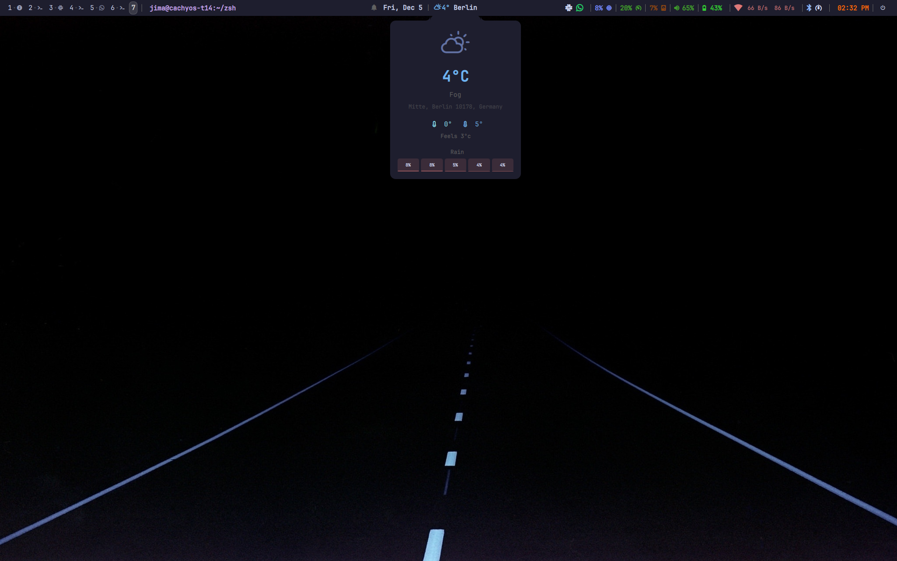

# Quickshell Bar for Hyprland

A modern, feature-rich status bar for Hyprland built with [Quickshell](https://quickshell.outfoxxed.me/). Features a clean design with notch-style dropdown popups, weather integration, system monitoring, and more.


## Preview



## Features

- **Workspaces**: Pill-shaped indicators with workspace numbers and app icons
- **Window Info**: Current window title display
- **Weather Widget**: Click-to-open popup with detailed forecast, temperature coloring, hourly rain predictions, and offline caching
- **System Stats**: CPU, memory, disk usage, volume (with audio sink detection), and battery
- **Network**: WiFi status with real-time upload/download speeds
- **Bluetooth**: Device status with connection indicator
- **Power Profiles**: Quick switching between power modes
- **DND Toggle**: Do Not Disturb mode via swaync
- **Power Menu**: Lock, logout, reboot, and shutdown options
- **Notch Design**: Elegant dropdown popups with concave corner notches connecting to the bar

## Dependencies

- [Quickshell](https://quickshell.outfoxxed.me/) - The shell framework
- [Hyprland](https://hyprland.org/) - Wayland compositor
- `nmcli` - WiFi management
- `bluetoothctl` - Bluetooth management
- `powerprofilesctl` - Power profile switching
- `swaync` / `swaync-client` - Notification daemon with DND support
- `wpctl` / `pactl` - Audio control
- `hyprctl` - Hyprland IPC
- `jq` - JSON parsing
- A [Nerd Font](https://www.nerdfonts.com/) - For icons (Material Design Icons range recommended)

### Optional

- Weather script at `~/.config/hypr/UserScripts/Weather.py` - For weather data (outputs JSON with waybar-compatible format)

## Installation

1. Install Quickshell following the [official guide](https://quickshell.outfoxxed.me/docs/guide/intro.html)

2. Clone this repository:
   ```bash
   git clone https://github.com/yourusername/quickshell-config.git ~/.config/quickshell
   ```

3. Start Quickshell:
   ```bash
   quickshell
   ```

4. (Optional) Add to your Hyprland config to start on login:
   ```ini
   exec-once = quickshell
   ```

## Configuration

### Theme

Edit `Theme.qml` to customize colors, fonts, and sizes:

```qml
pragma Singleton
import QtQuick

QtObject {
    property color colBg: "#1e1e2e"
    property color colFg: "#cdd6f4"
    property color colMuted: "#6c7086"
    // ... more colors

    property int fontSize: 13
    property string fontFamily: "JetBrainsMono Nerd Font"
}
```

### Adding Widgets

See `CLAUDE.md` for detailed documentation on the architecture and how to create new widgets.

## File Structure

```
shell.qml              # Main entry point
Theme.qml              # Color/font theme singleton
qmldir                 # QML module definition
components/
  ├── DropdownWidget.qml    # Base for dropdown widgets (with notch design)
  ├── WorkspaceBar.qml      # Workspace indicators
  ├── WindowInfo.qml        # Active window title
  ├── CenterInfo.qml        # Date, DND, weather
  ├── SystemStats.qml       # System monitoring
  ├── Clock.qml             # Time display
  ├── WifiWidget.qml        # WiFi with speeds
  ├── BluetoothWidget.qml   # Bluetooth status
  ├── PowerProfileWidget.qml # Power profiles
  ├── PowerWidget.qml       # Power menu
  ├── SlackWidget.qml       # Slack indicator
  ├── WhatsAppWidget.qml    # WhatsApp indicator
  └── Separator.qml         # Visual separator
```

## Key Patterns

- **Hot Reload**: Changes are applied automatically on save
- **Process + SplitParser**: Shell commands for data fetching
- **HyprlandFocusGrab**: Click-outside to close popups
- **Notch Design**: Dropdowns use Canvas-drawn shapes with concave corners

## Credits & Inspiration

- **[quickshell-btw](https://github.com/tonybanters/quickshell-btw)** by Tony Banters - Major inspiration for this configuration
- **[Quickshell](https://quickshell.outfoxxed.me/)** - The amazing shell framework by outfoxxed
- **[Hyprland](https://hyprland.org/)** - The dynamic tiling Wayland compositor

## License

MIT License - Feel free to use, modify, and distribute.

## Contributing

Contributions are welcome! Feel free to open issues or submit pull requests.
